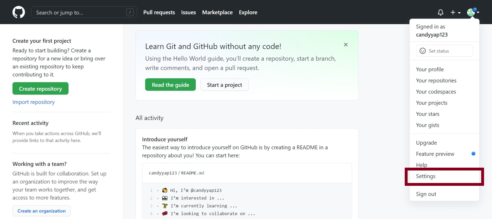
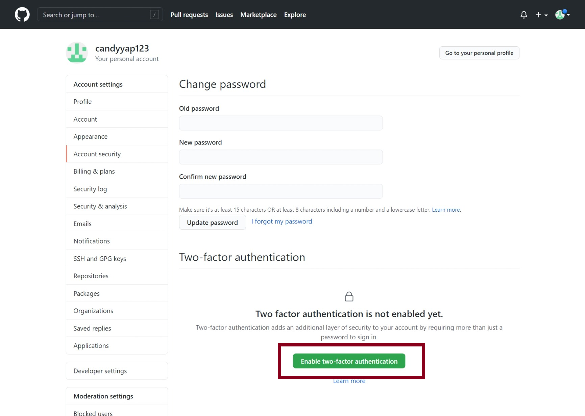
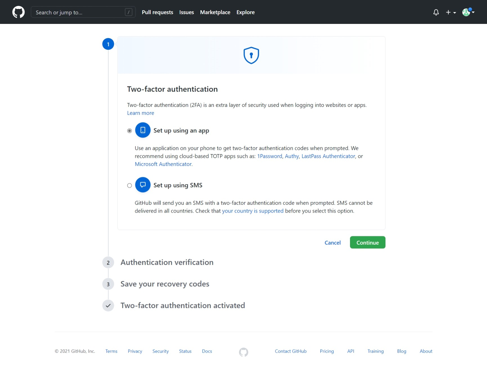
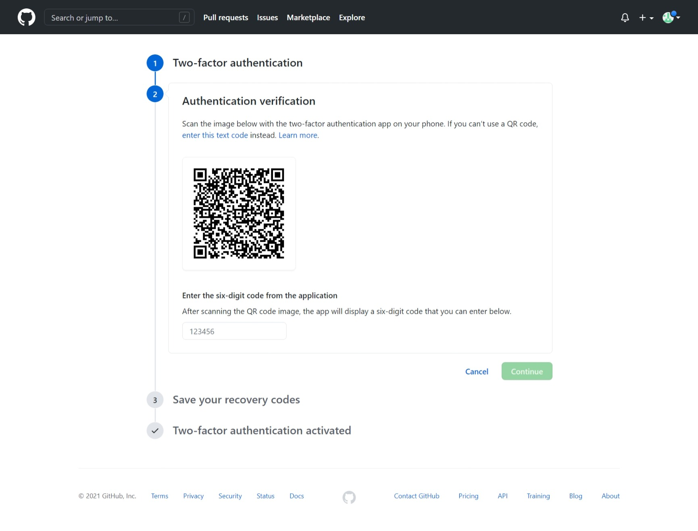
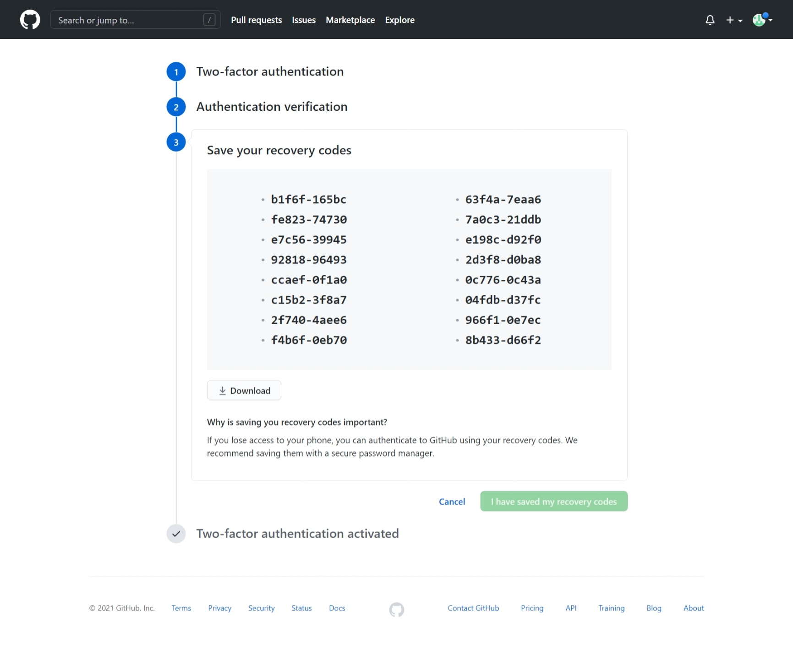
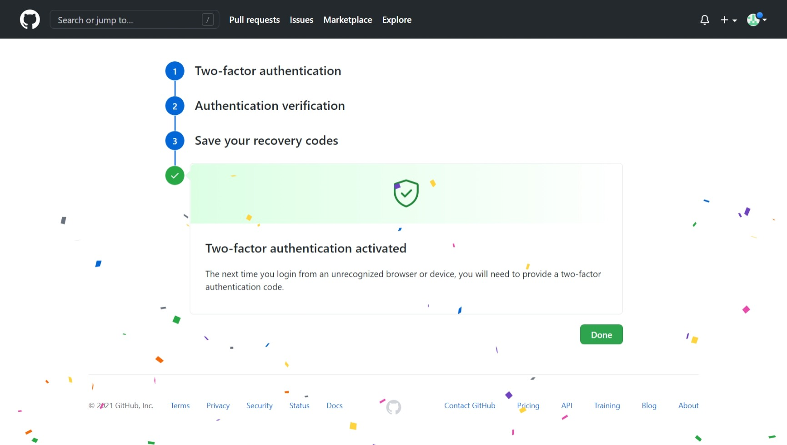

### Overview

GitHub will be the main interface you will need to interact with, in order to publish your article. Please register for a GitHub account if you 
do not already have one. Listed below are the steps to register for one. Once you register the GitHub account, you can directly email us at
<gds_developer_portal@tech.gov.sg> your GitHub account name for us to add you to the developer portal. Alternatively, if you already have an existing account,
just drop us an email with you current account name so that we will grant the write access.

Head to [https://github.com/join](https://github.com/join ':target=_blank'), and sign up for an account using your preferred email address and professional username.

   

Fig 1: GitHub Account Setup
 
  
Upon successful signup, you should receive a Welcome email in the email address provided.
  
### GitHub 2FA Setup

2-Factor Authentication (2FA) helps to ensure you GitHub account remains secure to attacks. Dev Portal requires users to have 2FA enabled in their accounts.  

Step 1: Click on your profile picture on the top right hand corner of the page, select "Settings" and await redirection.

Fig 1: Setting up 2FA
 

Step 2: Select the 'Account security' in the left navigation bar.

Fig 2: Accessing 'Account security' configuration page
 

Step 3: Click on 'Enable two-factor authentication' to proceed.

Fig 3: Enabling two-factor authentication
 

Step 4: Select the desired 2FA authentication method. There is the option to choose either the use of a third-party application (Google Authenticator, Authy, LastPass, etc.)
or via and SMS message.

Fig 4: Setting 2FA authentication method
 

Step 5: Scan the QR code using the preferred 2FA authentication method to obtain the six-digit code.

Fig 5: Getting the six-digit code
 

Step 6: Save the recovery codes in this step, which guaranteed the owner of the account in the event 2FA fails. It is strongly encouraged to store these codes securely.

Fig 6: Saving the recovery codes
 

Step 7: Once completed, you will see a banner showing 'Two-factor authentication activated'.

Fig 7: Setting up 2FA successfully 

