### Overview

In this walkthough, we will be attempting to publish a documentation named My First Documentation as an example, which is located in the collection **Technologies** and 
sub-collection **Analytics**.

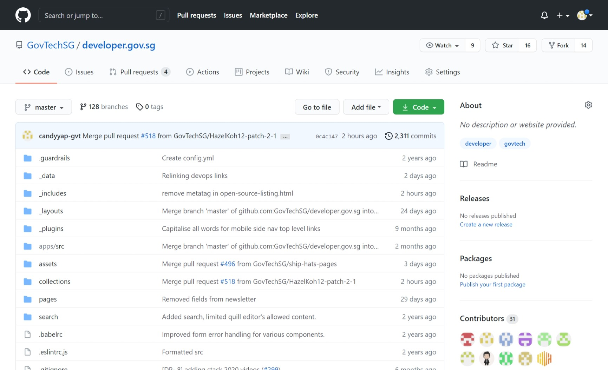
<p align="center">Fig 1: Master code view in GitHub</p><br />

Step 1: Create a new branch to work on. This branch will contain all the work you will be doing.

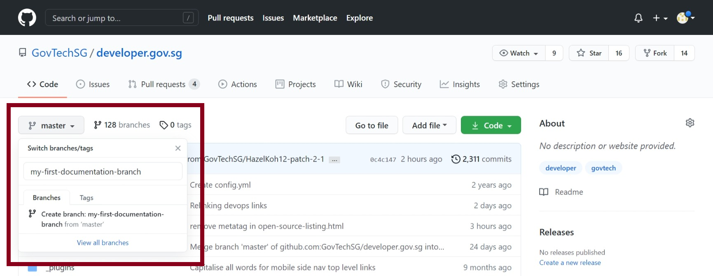
<p align="center">Fig 2: Creating a new branch</p><br />

Step 2: Uploading images to /assets/img/. Navigate to the directory and upload you files. Name the image files in this naming convention: product-name-alise.png 
(e.g. my-first-documentation-analytics-dashboard.png).

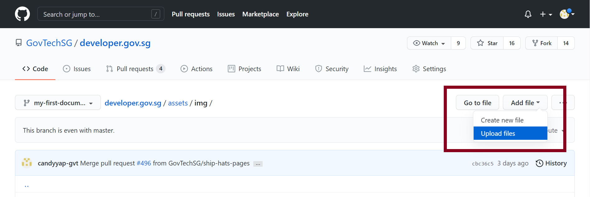
<p align="center">Fig 3: Uploading images</p><br />

Step 3: After uploading the necessary images required for your documentation, commit the change into the branch.

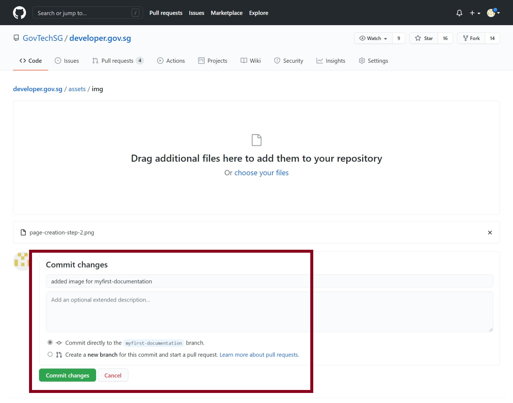
<p align="center">Fig 4: Committing new images into the branch</p><br />

Step 4: Next, navigate to the designated folder you have been informed of. The directory will be in the format/collections/[COLLECTION_NAME]/[SUB-COLLECTION_NAME]. In this example it would be /collections/\_technologies/analytics.

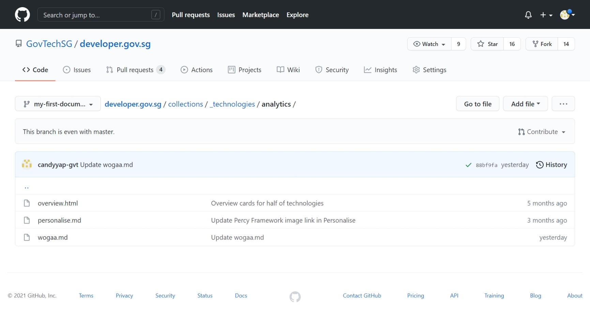
<p align="center">Fig 5: Navigating to designated folder</p><br />

Step 5: Add a new file, which will contain the documentation. Name your documentation [DOCUMENTATION_NAME].md (e.g. gowhere-suite.md). The file name should be in lower case, and spaces separated by hyphens.

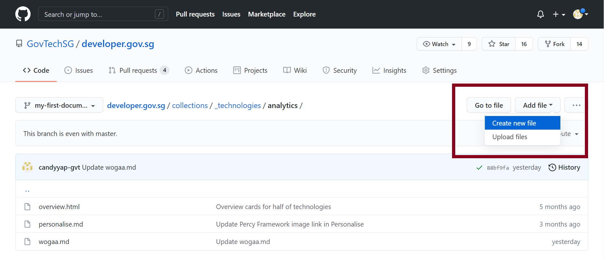
<p align="center">Fig 6: Creating new md file</p><br />

Step 6: In the documentation, you will have to include both front matter and content. Here is an example of a front matter, where you have to make changes to the
**title**, **category** and **description**.

The title is essentially your product name, follow by your product tagline (e.g. product name - product tagline). The category is the sub-collection that is tagged to your
product and the description should include a summary of your product (not more than 160 characters) as this will give readers an overview of your product on the overview
page before readers click into your product page.

"---"<br />
"title: My First Documentation"<br />
"layout: layout-page-sidenav"<br />
"category: Analytics"<br />
"description: >"<br />
"  My First Documentation is..."<br />
"---"

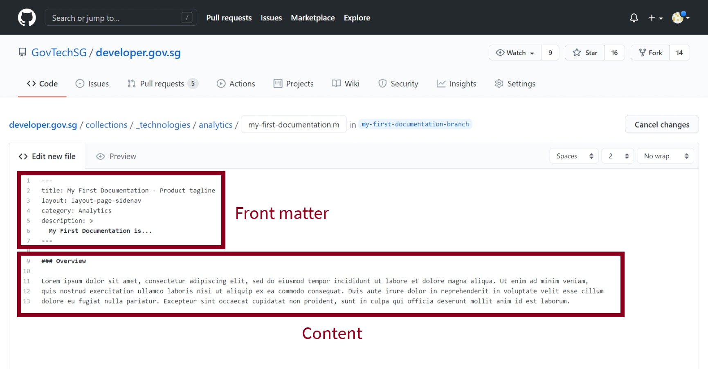
<p align="center">Fig 7: Md file content</p><br />

Step 7: For videos, please ensure videos are upload to Youtube before embedding into your documentation. Use the code below to embed your video.

```
<iframe src="https://www.youtube.com/embed/<video-id>?showinfo=0" frameborder="0" allow="accelerometer; autoplay; encrypted-media; gyroscope; picture-in-picture" allowfullscreen></iframe>
```
<br />

Step 8: Commit the changes once done, into the branch.

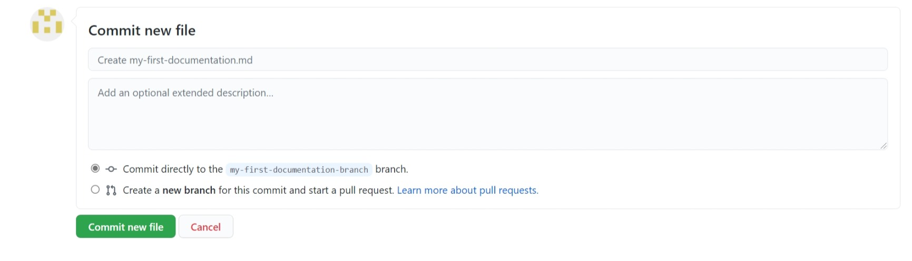
<p align="center">Fig 8: Committing new md file into the branch</p><br />

Step 9: You will have to link the documentation to the left navigation bar for easy navigation. Head over to /\_data folder. Locate the collection you were designated
(in this case, technologies.yml), and open it. This is a YAML configuration file which you will have to edit.

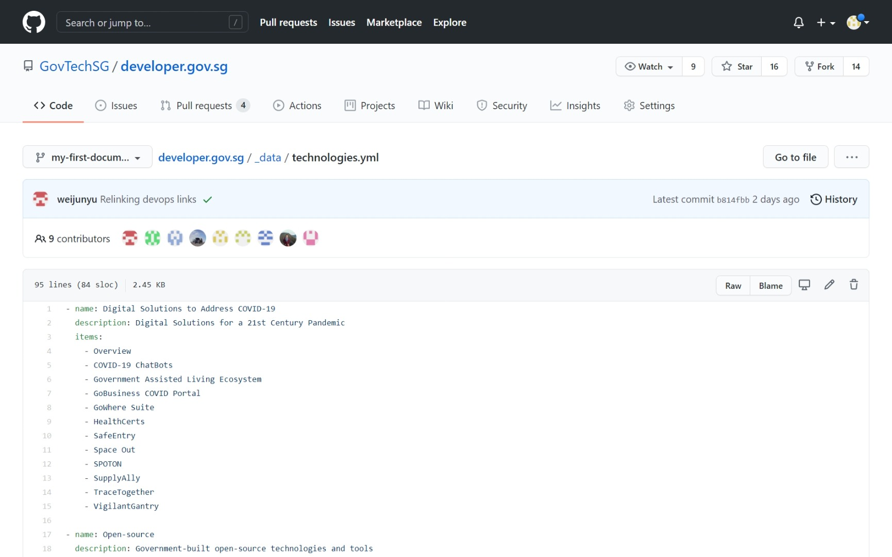
<p align="center">Fig 9: Content in technologies.yml</p><br />

Step 10: Add in the name of the documentation (e.g. My First Documentation) you are intending to publish. Adding the documentation to the list of items will allow it to
render a link which displays my-first-documention.md created previously.

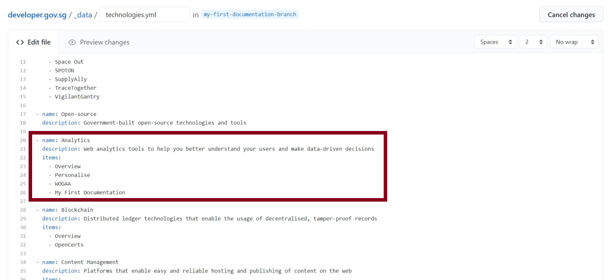
<p align="center">Fig 10: Updating technologies.yml</p><br />

Step 11: Commit the changes as usual into the branch.

Step 12: Create a pull request from your branch into master

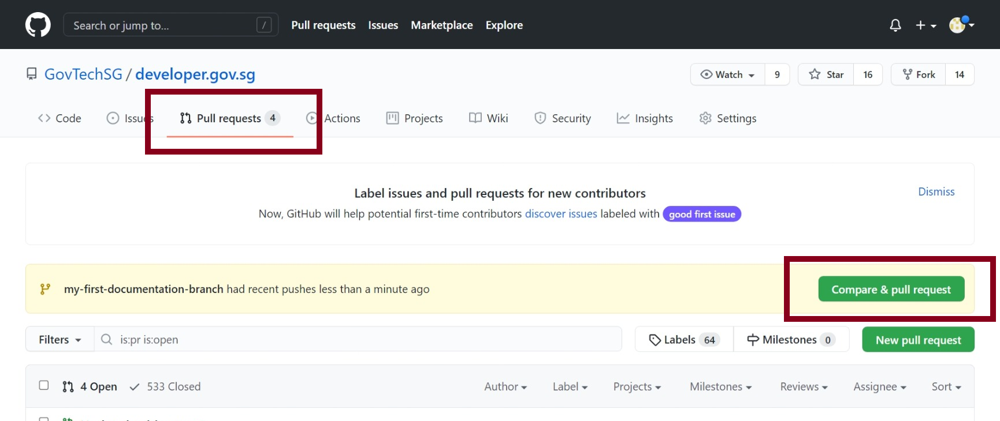<br />
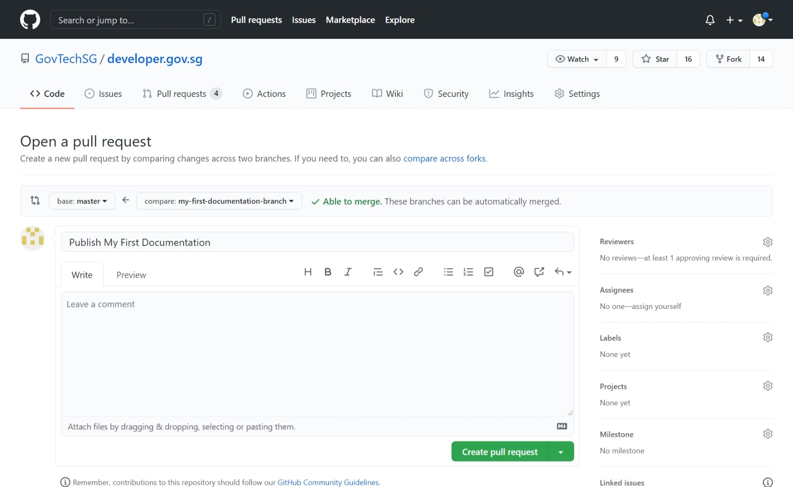
<p align="center">Fig 12: Creating a pull request</p><br />

Step 13: Head over to the pull request, and click on the check provided by AWS Amplify Console. You will be redirected to a webpage containing a link to the preview site.
Click on the link and you should see a preview version of the Dev Portal which includes your documentation.

Should you not be satisfied with the content, edit the documentation from Step 6 and commit again once done. The pull requet will be updated automatically and a
new preview link will be available.

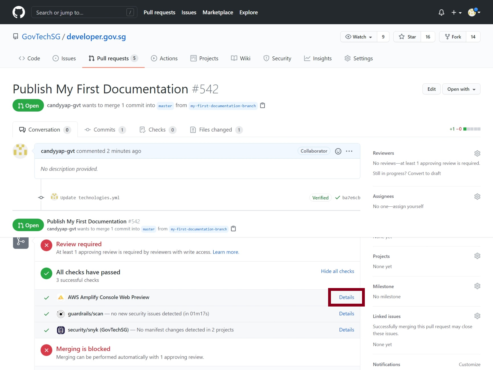<br />
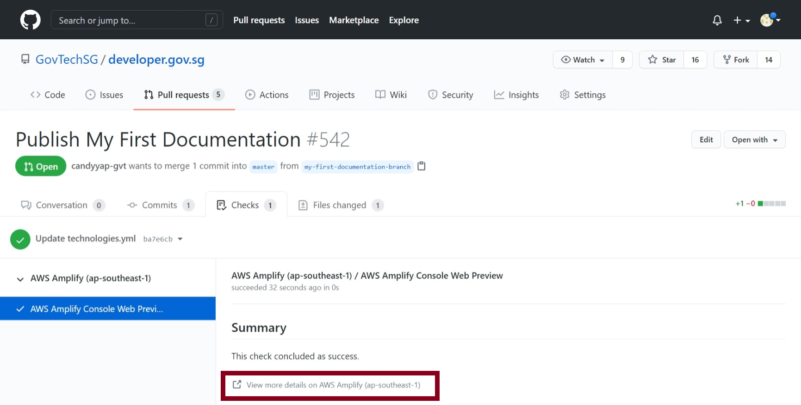
<p align="center">Fig 13: Previewing the new documentation</p><br />

Step 14: Once you are satisfied with the3 page and ready for it to be published. You can request a review from the content-approver team (candyyap-gvt and HazelKoh12)
to approve and merge your pull request.

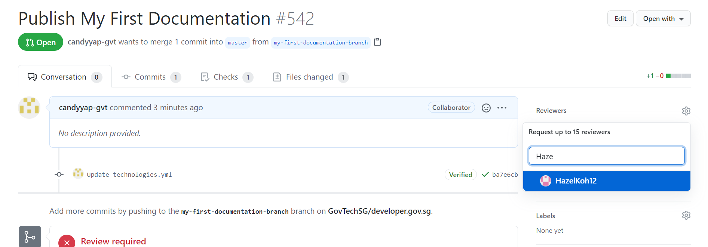
<p align="center">Fig 14: Requesting for approval</p><br />

Step 15: Once the pull request is merged, your changes will go live. Congratulations! You have just published your first documentation successfully.

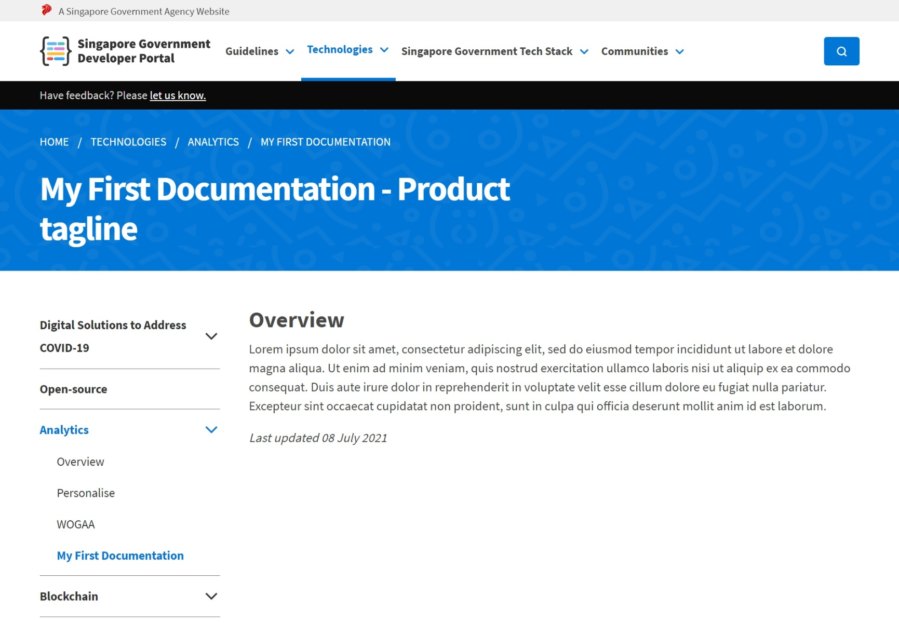
<p align="center">Fig 15: Documentation page in Dev Portal</p><br />


