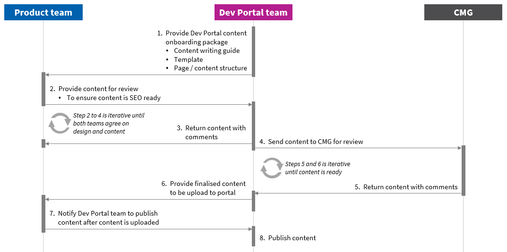

### Overview

This guide provides the steps to use GitHub to upload new content and update existing content onto the Singapore Government Developer Portal (Dev Portal).
It also provides the content writing guide and template to help content writer prepare the content to be published in Dev Portal.

Should you have any queries about publishing on the portal or in need of any help, you can contact us at <gds_developer_portal@tech.gov.sg>.

### Content Publishing Process

<figure style="text-align: center">
  
  <figcaption>Fig 1: Content Publishing Process</figcaption>
</figure>

### Content Reviewer

If you do not have a reviewer within you team, you can send a request to Candy (candyyap-gvt) or Hazel (HazelKoh12) to review the new or updated content.

After selecting Candy or Hazel as the reviewer in GitHub, send an email to them at <candy_yap@tech.gov.sg> or <hazel_koh@tech.gov.sg>. Include the following information in the email:

1. Pull request number;
2. What are the pages created/updated; and
3. What content were created/updated.

The review request will be approved within 3 working days and the team will be notified. Do check the content before submitting the content publish request.

### Content Approver

To publish the content, send an email to Candy at <candy_yap@tech.gov.sg> or Hazel at <hazel_koh@tech.gov.sg> indicating that the content is ready to be published.

If the reviewer is not Candy or Hazel, provide the following information in the email:

1. Pull request number;
2. What are the pages created/updated; and
3. What content were created/updated.

### Dos

1. All content must be in *markdown* format. Special requests will be subjected to Dev Portal team's approval.
2. Each md file must have a *'title'*,which is your product name, follow by your product tagline (e.g. product name - product tagline).
3. A metadescription is required for each md file. This will be a description of your product (not more than 160 characters) which will be published in the overview page before readers click into your product page.
4. Headers size must be *###*.
5. All pictures must be referenced with caption *'Fig \<number\>: \<picture caption\>'*.
6. All pictures must be accompanied by *'alternative text (Alt Text)'*. Alt Text shall be the same as the caption used for the picture, including *'Fig \<number\>:'*.

### Don'ts

1. Do not create additional pages. If additional pages are required, send a request to <gds_developer_portal@tech.gov.sg> and provide the purpose for these additional pages.

### FAQs

Before you start creating content, refer to [FAQs](/faqs) for more tips on publishing content in Singapore Government Developer Portal.

### Contact Information

For enquiries, email us at <gds_developer_portal@tech.gov.sg>.
